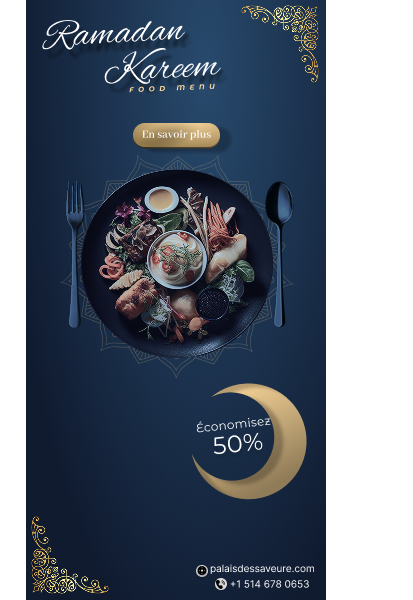
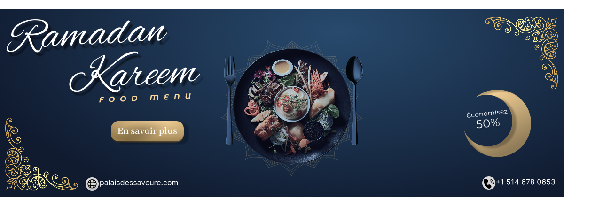
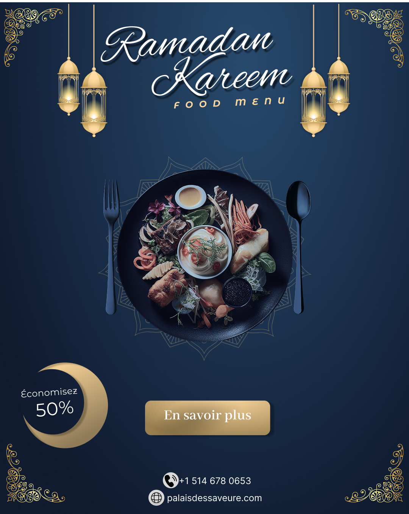
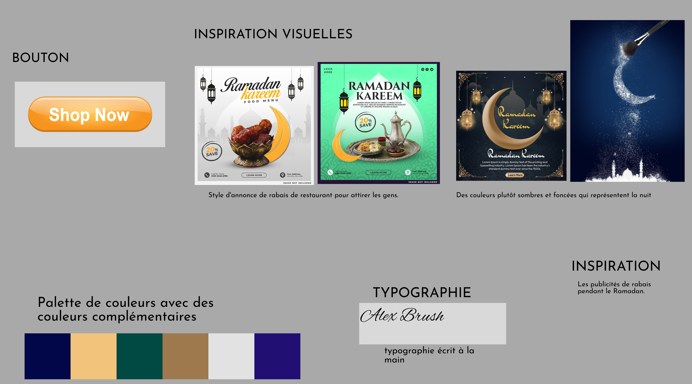
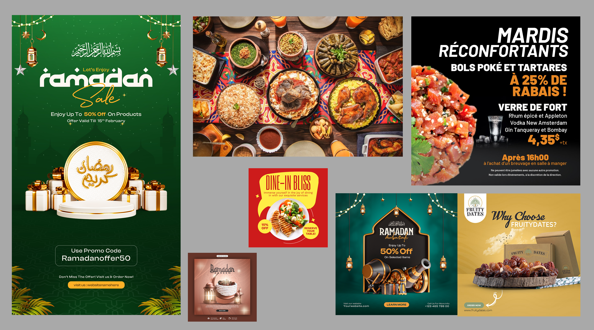
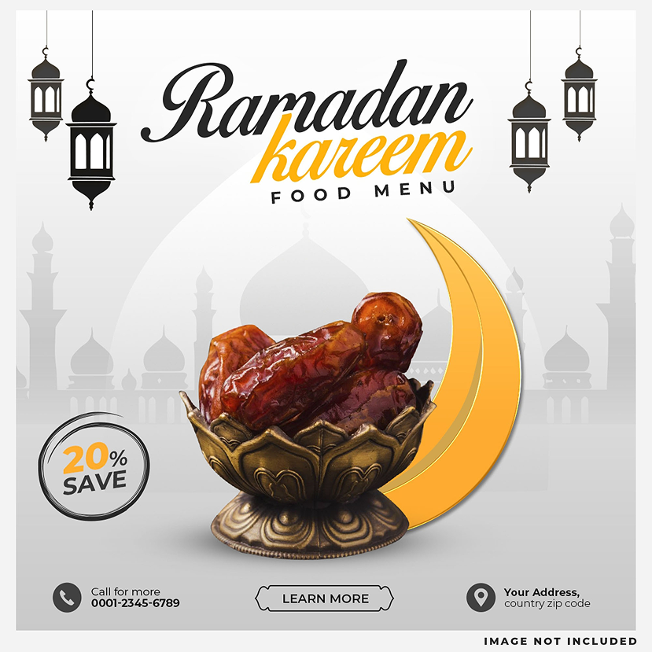
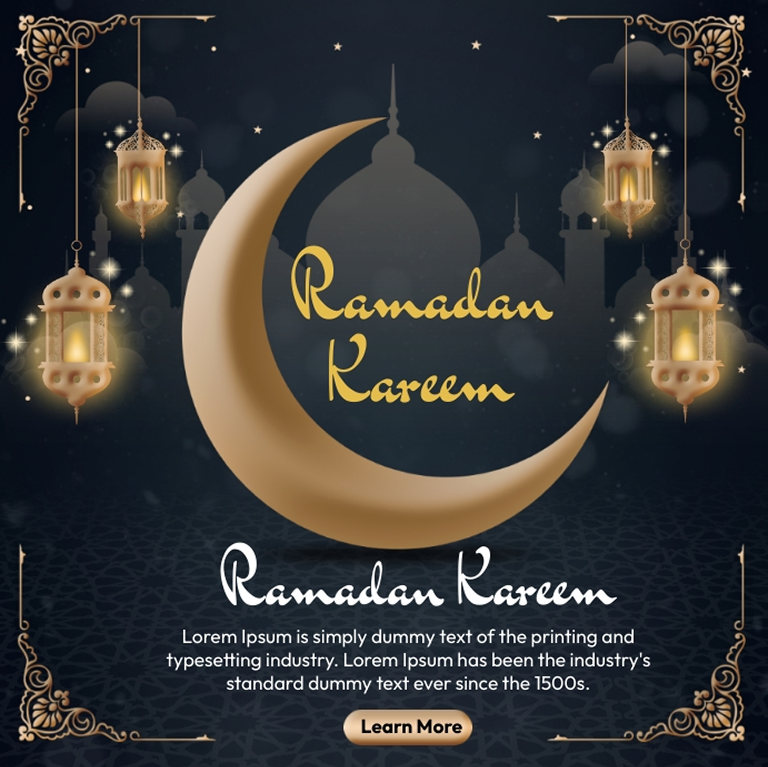

# Planification de mon portfolio

## Compétences

* Réaliser et tourner des vidéos
* Animer des créations 2D et 3D
* Concevoir des compositions sonores et visuelles interactives
* Exploiter les nouvelles technologies et leur potentiel créateur
* Penser et optimiser l’expérience utilisateur
* Créer des univers immersifs et interactifs

## Logiciels

* Visual Studio Code
* Photoshop
* DaVinci Resolve
* Maya
* Unity
* Reaper
* Max

## Langages de programmation

* **HTML** — À l’aise
* **CSS** — À l’aise
* **JavaScript** — Niveau correct

## Projet 1 : La Chasse

**Nom du projet :**
La Chasse

**Mention académique ou personnel :**
Projet académique

**Réalisé dans le cadre du cours :**
Audio 2D, traitement audiovisuel et animation 3D

**Individuel ou en équipe :**
Individuel

**Nom des coéquipiers :**
Aucun

**Rôle(s) dans le projet :**
Créateur et concepteur. J’ai réalisé l’ensemble du projet.

**Logiciels ou techniques utilisées :**
Max, TouchDesigner et Maya

**Catégorie du projet :**
Performance audiovisuelle

**Description courte du projet :**
Une performance audiovisuelle diffusée par un projecteur et des haut-parleurs.

**Description du projet :**
Le professeur nous a demandé de créer une performance audiovisuelle créative comprenant un minimum de quatre scènes, dont une scène utilisant notre animation 3D réalisée sans TouchDesigner. La performance devait aussi intégrer une ambiance sonore et des effets sonores créés et gérés avec Max.

**Description du projet :**
J’ai créé une performance audiovisuelle qui évoque la thalassophobie, en mettant l’accent sur un environnement qui rappelle les profondeurs de l’océan. J’ai créé une ambiance sonore sous-marine avec des sons de créatures et de poissons afin de créer un sentiment de peur, de malaise et d’inconfort.

**Lien vers la documentation du projet :**
[la chasse lien youtube](https://youtu.be/zx5qwowoRbc)
---

## Projet 2 : Scène réactive

**Nom du projet :**
Scène réactive

**Mention académique ou personnel :**
Projet académique

**Réalisé dans le cadre du cours :**
Interactivité ludique

**Individuel ou en équipe :**
Individuel

**Nom des coéquipiers :**
Aucun

**Rôle(s) dans le projet :**
Créateur et concepteur. J’ai réalisé l’ensemble du projet.

**Logiciels ou techniques utilisées :**
Godot, Godot Script et Visual Studio Code. Visual Studio Code a aussi été utilisé pour faire le lien entre Godot et GitHub.

**Catégorie du projet :**
Scène interactive (2D game)

**Description courte du projet :**
Une scène interactive 2D avec quelques mécaniques intéressantes et originales.

**Description du projet :**
Le professeur nous a demandé de réaliser une expérience ludique et interactive comprenant des images et des échantillons sonores, dans laquelle l’interacteur progresse en accomplissant différentes actions.

**Description du projet :**
J’ai créé un jeu de plateforme 2D avec un style cartoon qui rappelle les jeux comme Mario. Le joueur possède plusieurs vies et doit progresser à travers trois niveaux en récoltant des fruits, avec des mécaniques de déplacement et de saut ainsi que différents obstacles comme des scies et des pics; le premier niveau sert de tutoriel.

**Lien vers la documentation du projet :**
[GitHub — TP4_Yasser](https://github.com/Yasser-ElF/TP4_Yasser/tree/main)

---

## Projet 3 : Disparaître

**Nom du projet :**
Disparaître

**Mention académique ou personnel :**
Projet académique

**Réalisé dans le cadre du cours :**
Vidéo 2

**Individuel ou en équipe :**
En équipe

**Nom des coéquipiers :**
Ben Fradj, Adam Elchoueiri, Karim Fadi Sulici, Vasile Dominique, Tyler Richard

**Rôle(s) dans le projet :**
Réalisateur, montage visuel et sonore, caméraman

**Logiciels ou techniques utilisées :**
DaVinci Resolve, stop motion et Foley

**Catégorie du projet :**
Court métrage en stop motion d’environ 1 minute

**Description courte du projet :**
Un court métrage en stop motion qui représente la solitude et les troubles émotionnels d’une personne.

**Description du projet :**
Le professeur nous a demandé de créer une installation immersive ou une présentation vidéo mosaïque en utilisant des éléments visuels et sonores pour raconter une histoire. Nous devions filmer nos propres séquences, réaliser l’ensemble de la vidéo en stop motion et créer une bande sonore composée exclusivement de sons enregistrés en studio Foley.

**Description du projet :**
J’ai créé, avec mon équipe, un film qui représente la solitude et les troubles émotionnels qu’une personne peut vivre. Le film montre comment certains traits de personnalité peuvent progressivement disparaître et être remplacés par d’autres, ce qui peut créer des comportements dangereux chez certaines personnes vivant avec des troubles émotionnels ou psychologiques.

**Lien vers la documentation du projet :**
[Disparaitre lien youtube](https://youtu.be/yRWwUVZQnKA)

---

## Projet 4 : Pub Web : Ramadan Kareem

**Nom du projet :**
Pub Web : Ramadan Kareem Food Menu (50 % OFF)

**Mention académique ou personnel :**
Projet académique

**Réalisé dans le cadre du cours :**
Design graphique

**Individuel ou en équipe :**
Individuel

**Nom des coéquipiers :**
Aucun

**Rôle(s) dans le projet :**
Concepteur et créateur. J’ai réalisé l’ensemble du projet.

**Logiciels ou techniques utilisées :**
Figma

**Catégorie du projet :**
Publicité Web / Design graphique

**Description courte du projet :**
Une publicité Web pour un restaurant musulman annonçant une promotion de 50 % de rabais sur son menu pour le Ramadan.

**Description du projet :**
Le professeur nous a demandé de créer une campagne de publicité Web en plusieurs formats pour présenter un sujet qui nous passionne, tout en respectant le principe de simplicité. Nous devions créer trois compositions différentes et harmonieuses pour un post Instagram et deux bannières Web, avec un slogan ou une accroche, un élément visuel et un bouton permettant de passer à l’action.

**Description du projet :**
J’ai créé une publicité Web sur le thème du Ramadan pour un restaurant musulman, avec une promotion de 50 % de rabais sur ses plats. La publicité présente une photo d’un plat, le site Web et le numéro de téléphone du restaurant ainsi qu’un bouton « En savoir plus » qui permet au client d’accéder à la page en ligne du restaurant.

**Documentation du projet :**

  
  
  

# Processus de création du projet

## Étape 1: Création du moodboard
Pour commencer, j’ai créé un moodboard pour définir l’ambiance générale de mon projet. J’ai rassemblé plusieurs images en lien avec le Ramadan, la nourriture et la publicité.

J’ai aussi commencé à réfléchir aux couleurs, aux styles, aux formes et aux typographies que je pourrais utiliser. Cette étape m’a aidé à avoir une première idée de la direction que je voulais prendre.

## Étape 2 : Création de la planche d’inspiration
Après le moodboard, j’ai créé une planche d’inspiration plus précise. Elle m’a servi de guide pour commencer mon projet.

J’y ai ajouté les polices, les couleurs, le style graphique, le nom du restaurant, des exemples de photos, des exemples de publicités et les éléments décoratifs que je voulais utiliser.

Cette étape m’a permis de mieux définir le style final de ma publicité.

## Étape 3 : Recherche de publicités similaires
Avant de commencer ma publicité, j’ai regardé plusieurs publicités sur la nourriture et les promotions pour trouver de l’inspiration.

J’ai observé comment les autres publicités utilisent les photos de nourriture, les gros textes, les couleurs, les rabais et les boutons pour attirer l’attention.

Ces recherches m’ont donné des idées pour présenter mon offre de 50 % de rabais, tout en créant mon propre design.

## Étape 4 : Première création dans Figma
Après mes recherches, j’ai commencé à créer ma publicité dans Figma. Je me suis basé sur mon moodboard, ma planche d’inspiration et les idées que j’avais trouvées.

J’ai commencé à placer les différents éléments comme la photo du plat, le texte de la promotion, le nom du restaurant, les informations, le bouton « En savoir plus » et les décorations.

J’ai ensuite utilisé ma créativité pour créer une composition qui correspondait à mon idée du projet.

  

## Étape 5 : Développement de la composition
Après ma première version, j’ai essayé différentes façons de placer les éléments pour trouver une composition qui fonctionnait bien.

J’ai changé la taille des textes, la position des images, les couleurs et les espaces. Je voulais garder un design simple, mais aussi assez intéressant pour attirer l’attention sur la promotion.

J’ai aussi pris en compte les commentaires et les conseils de mon professeur pour améliorer mon design.

## Étape 6 : Adaptation aux trois formats
Une fois mon design principal terminé, je l’ai adapté aux trois formats demandés : un post Instagram et deux bannières Web.

J’ai gardé les mêmes couleurs, le même style et les mêmes éléments pour que les trois publicités restent cohérentes. J’ai cependant changé leur disposition pour qu’elles fonctionnent bien dans chaque format.

  
  
  

## Étape 7 : Corrections avec les commentaires du professeur
J’ai ensuite montré mon travail à mon professeur pour avoir des commentaires.

Grâce à ses conseils, j’ai fait plusieurs corrections au niveau de l’équilibre, de la lisibilité, de la hiérarchie des informations et du placement des éléments.

Cela m’a permis d’améliorer mon projet et de voir certains détails que je pouvais encore modifier.

## Étape 8 : Version finale
Après les dernières corrections, j’ai finalisé les trois publicités dans Figma. J’ai vérifié que toutes les informations importantes étaient présentes et que les trois formats avaient le même style.

Le résultat final est une campagne publicitaire sur le thème du Ramadan, avec une promotion de 50 % de rabais sur le menu du restaurant.

Ce projet est le résultat de mes recherches, de mes inspirations, de ma créativité et des conseils de mon professeur.

  

Ce projet est le résultat de mes recherches, de mes inspirations, de ma créativité et des conseils de mon professeur.

Image à insérer : les trois publicités finales.
